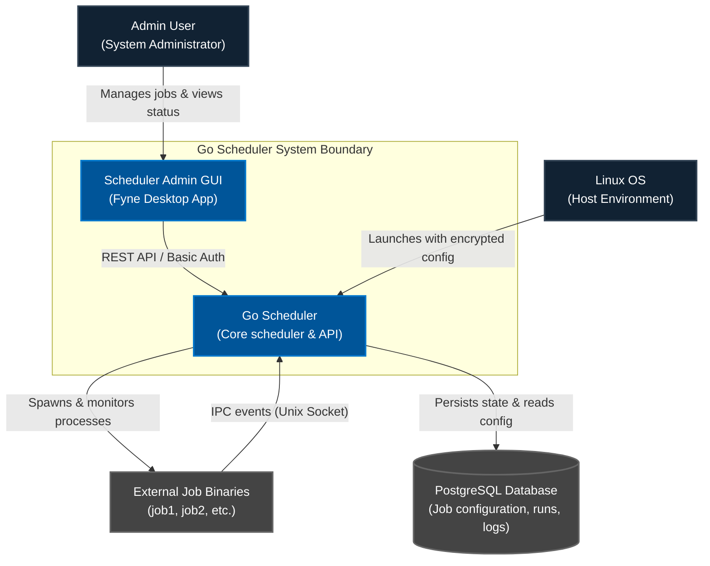
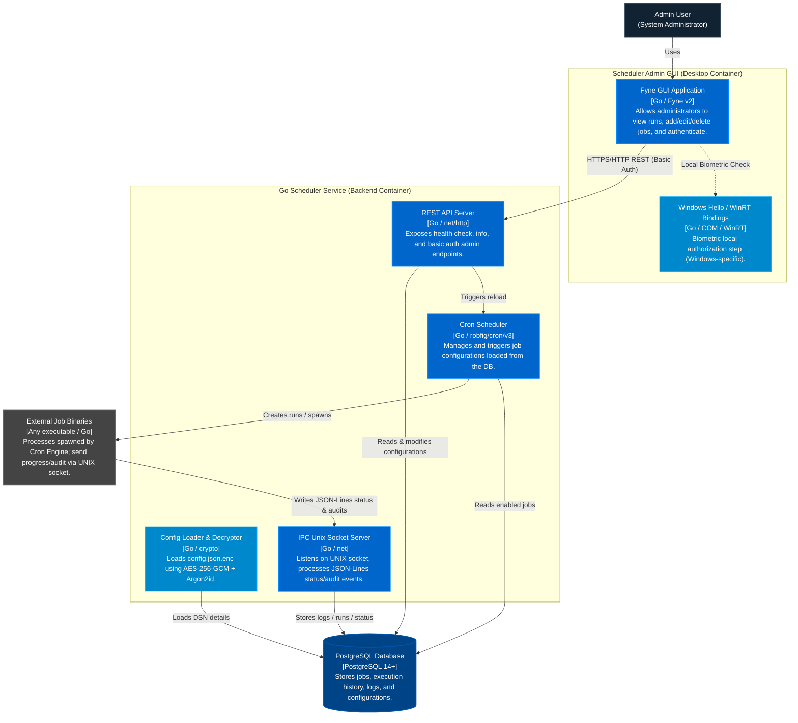

# Architecture Overview - Go Scheduler

This document provides a high-level overview of the **Go Scheduler** architecture using the C4 model.

Go Scheduler is a Linux system service designed to manage, execute, and monitor external Go programs (or other executables) on a cron-based schedule. It stores configurations, execution histories, and logs in a PostgreSQL database, communicates with jobs via a UNIX Domain Socket (JSON-Lines IPC), and offers a REST API + desktop GUI for remote administration.

---

## 1. C4 System Context Diagram

The System Context diagram shows how the Go Scheduler system interacts with users (Administrators), the host operating system, and the external job binaries it executes.

---

## 2. C4 Container Diagram

The Container diagram drills down into the Go Scheduler System, showing its internal containers, technology choices, and how they communicate.

---

## 3. Documents Directory Structure

The architectural details are split into specific focus areas:

- [System Components](system_components.md): Deep-dive into each internal package and command implementation.
- [Database Schema](database_schema.md): Details the PostgreSQL schema, table layouts, and relationships.
- [Data Flow & Sequence](data_flow.md): Traces how events flow through the system during job execution, admin reloads, and configurations.
