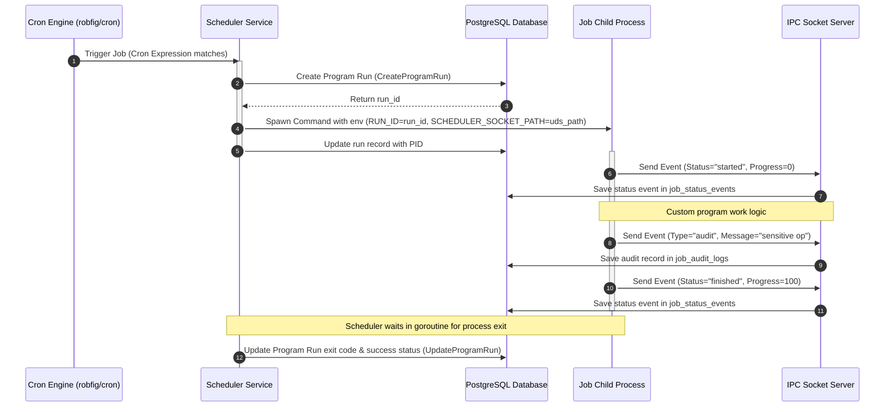
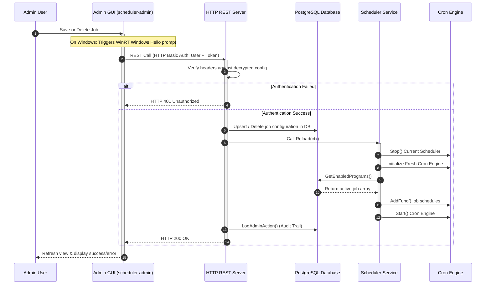

# Data Flow & Sequences - Go Scheduler

This document visualizes the runtime interactions and sequences of operations in Go Scheduler.

---

## 1. Job Execution & IPC Lifecycle

When the Cron Engine triggers a scheduled program, the following sequence details the process execution, environment injection, and socket communication:

### Key Stages:
1.  **Trigger**: The `robfig/cron/v3` scheduler fires based on the cron syntax in database.
2.  **Tracking Reservation**: The scheduler registers a run instance prior to launching the binary. This generates a unique `run_id`.
3.  **Process Isolation**: The program starts as a standalone process. It reads `RUN_ID` and `SCHEDULER_SOCKET_PATH` variables from its environment.
4.  **IPC (Unix Socket)**: The program dials the local socket streaming JSON-lines.
5.  **Termination Update**: Regardless of whether the process finishes cleanly or crashes, Go's `cmd.Wait()` detects the exit state, which is stored in the database.

---

## 2. Job Updates & Config Reloading

When an administrator edits, creates, or deletes job schedules via the desktop admin tool, this sequence shows the authentication flow and scheduler rebuild process:

### Key Stages:
1.  **Biometric Authorization (Windows-Specific)**: Prior to invoking the network stack, the GUI prompts Windows Hello. It uses `UserConsentVerifier` to execute biometrics locally.
2.  **Basic Authentication**: The HTTP API server authenticates requests against admin records (loaded from `config.json.enc`).
3.  **Hot-Reloading**: The Cron scheduler is stopped, rebuilt, and restarted. Enabled jobs are re-read from the DB. There is no service restart required, ensuring zero disruption to existing running jobs.
4.  **Audit Logs**: The administrative event, who performed it, and what changed are serialized as JSON and written to `admin_audit_logs` for tracking.
