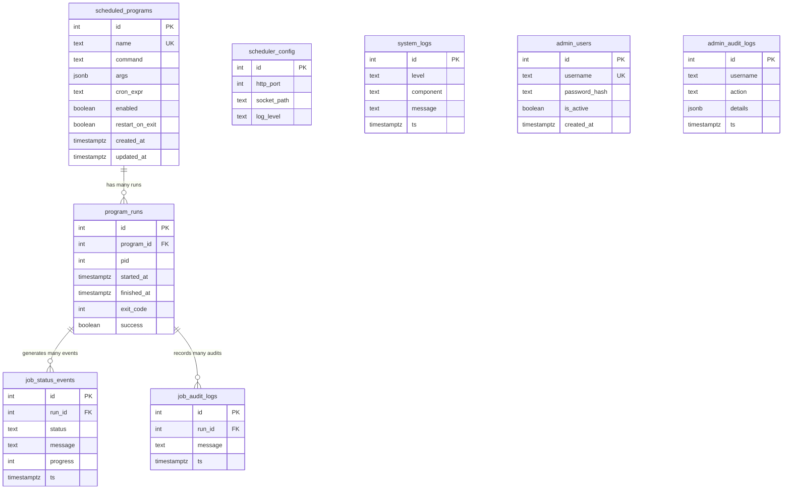

# Database Schema - Go Scheduler

This document details the PostgreSQL schema used by Go Scheduler. The database serves as the source of truth for job configurations, tracks system-wide logs, records run instances, stores IPC status updates, and handles administrative logs.

---

## 1. Entity-Relationship (ER) Diagram

The relationships between the tables are structured as follows:

---

## 2. Table Definitions & Fields

### 2.1 `scheduled_programs`
Stores the job definitions to be scheduled and run.
*   `id` (SERIAL PRIMARY KEY): Unique identifier.
*   `name` (TEXT NOT NULL UNIQUE): Name of the job configuration.
*   `command` (TEXT NOT NULL): The path/command of the executable.
*   `args` (JSONB DEFAULT '{}'::jsonb): Arguments passed to the command on execution.
*   `cron_expr` (TEXT NOT NULL): Standard cron expression governing when to run.
*   `enabled` (BOOLEAN DEFAULT true): Whether this job is active.
*   `restart_on_exit` (BOOLEAN DEFAULT false): If `true`, the scheduler restarts the program automatically on a failure status (non-zero exit code).
*   `created_at`/`updated_at` (TIMESTAMPTZ): Timestamps tracking insertion and modification.

### 2.2 `program_runs`
Tracks execution instances of scheduled jobs.
*   `id` (SERIAL PRIMARY KEY): Unique identifier, passed as `RUN_ID` to child jobs.
*   `program_id` (INT REFERENCES `scheduled_programs(id)` ON DELETE CASCADE): Link to the configuration.
*   `pid` (INT): Process ID assigned by the host OS.
*   `started_at` (TIMESTAMPTZ DEFAULT CURRENT_TIMESTAMP): Timestamp when the process started.
*   `finished_at` (TIMESTAMPTZ NULL): Timestamp when the process finished.
*   `exit_code` (INT NULL): System exit code.
*   `success` (BOOLEAN NULL): `true` if exit code is `0`, otherwise `false`.

### 2.3 `job_status_events`
Saves progress and status milestones received from job processes via IPC.
*   `id` (SERIAL PRIMARY KEY): Unique identifier.
*   `run_id` (INT REFERENCES `program_runs(id)` ON DELETE CASCADE): Associated run instance.
*   `status` (TEXT): Current job step status (e.g. `started`, `processing`, `finished`).
*   `message` (TEXT): Diagnostic message explaining the progress.
*   `progress` (INT): Percentage of progress (0 to 100).
*   `ts` (TIMESTAMPTZ DEFAULT CURRENT_TIMESTAMP): Event record time.

### 2.4 `job_audit_logs`
Stores security-sensitive or business-critical audit events reported by jobs.
*   `id` (SERIAL PRIMARY KEY): Unique identifier.
*   `run_id` (INT REFERENCES `program_runs(id)` ON DELETE CASCADE): Associated run instance.
*   `message` (TEXT): Detailed audit message.
*   `ts` (TIMESTAMPTZ): Audit record time.

### 2.5 `scheduler_config`
Global configurations for the daemon.
*   `id` (SERIAL PRIMARY KEY): Unique identifier.
*   `http_port` (INT DEFAULT 8080): Port on which the HTTP server binds.
*   `socket_path` (TEXT DEFAULT '/tmp/scheduler.sock'): Path of the IPC UNIX domain socket.
*   `log_level` (TEXT DEFAULT 'INFO'): Global system log filter level.

### 2.6 `system_logs`
Centralized service logs for debugging and auditing the core daemon itself.
*   `id` (SERIAL PRIMARY KEY): Unique identifier.
*   `level` (TEXT NOT NULL): Severity level (`DEBUG`, `INFO`, `ERROR`).
*   `component` (TEXT NOT NULL): Daemon subsystem (`Scheduler`, `HTTP`, `IPC`).
*   `message` (TEXT NOT NULL): Detailed log message.
*   `ts` (TIMESTAMPTZ): Log insertion time.

### 2.7 `admin_users`
Authorized administrative accounts.
*   `id` (SERIAL PRIMARY KEY): Unique identifier.
*   `username` (TEXT UNIQUE NOT NULL): Unique login name.
*   `password_hash` (TEXT NOT NULL): Secure hashed password.
*   `is_active` (BOOLEAN DEFAULT true): Activity status.
*   `created_at` (TIMESTAMPTZ): Date created.

### 2.8 `admin_audit_logs`
Tracks modifications, configuration reloads, and other actions triggered by administrators.
*   `id` (SERIAL PRIMARY KEY): Unique identifier.
*   `username` (TEXT NOT NULL): The administrative account performing the action.
*   `action` (TEXT NOT NULL): Action identifier (e.g. `delete_job`, `update_jobs_success`).
*   `details` (JSONB): Metadata detailing the action context (e.g., job names, errors, row counts).
*   `ts` (TIMESTAMPTZ): Action record timestamp.
