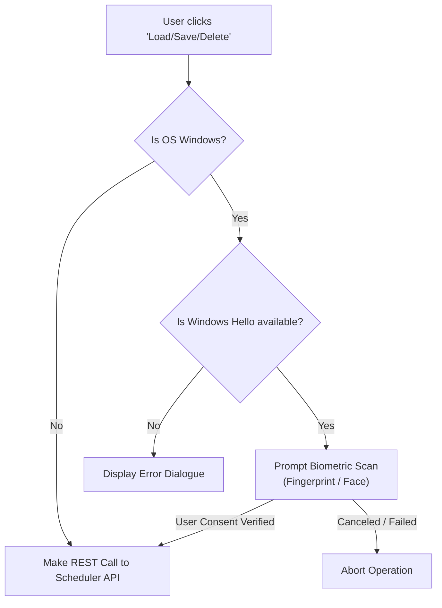
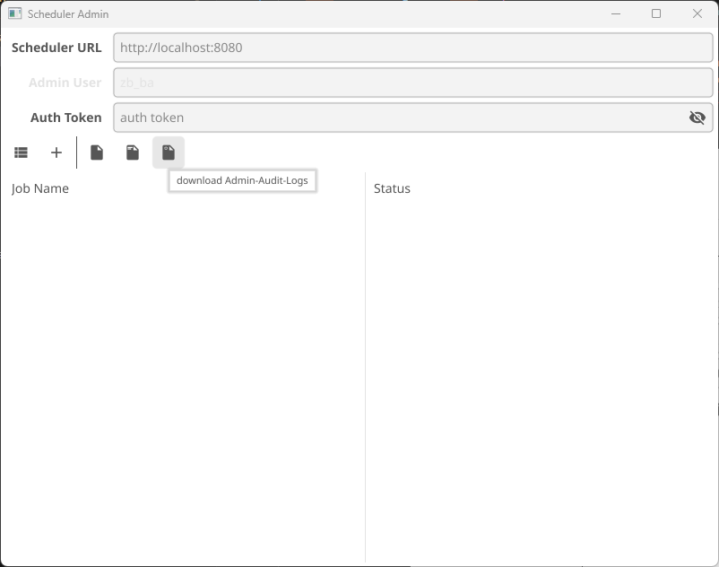
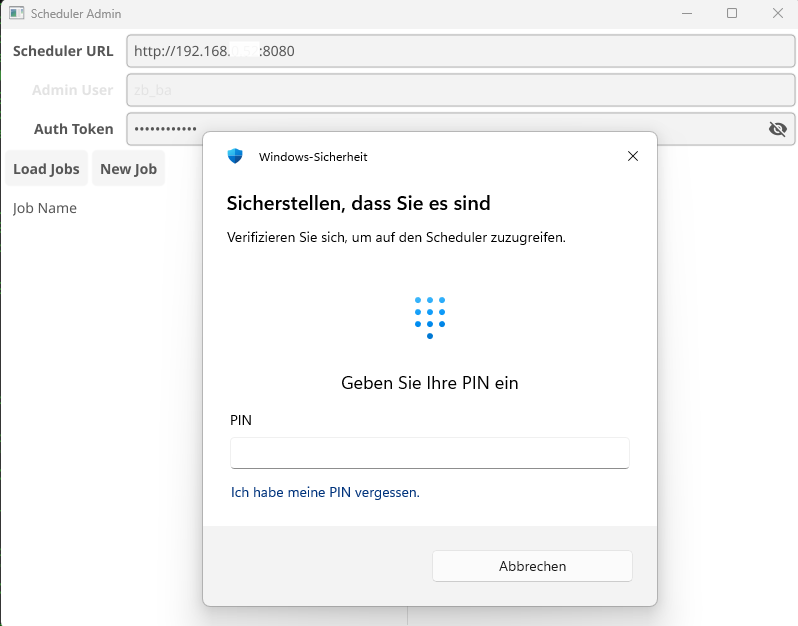
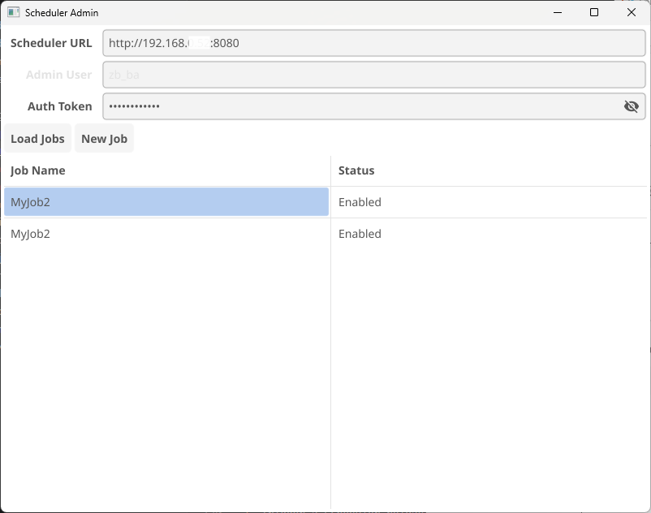
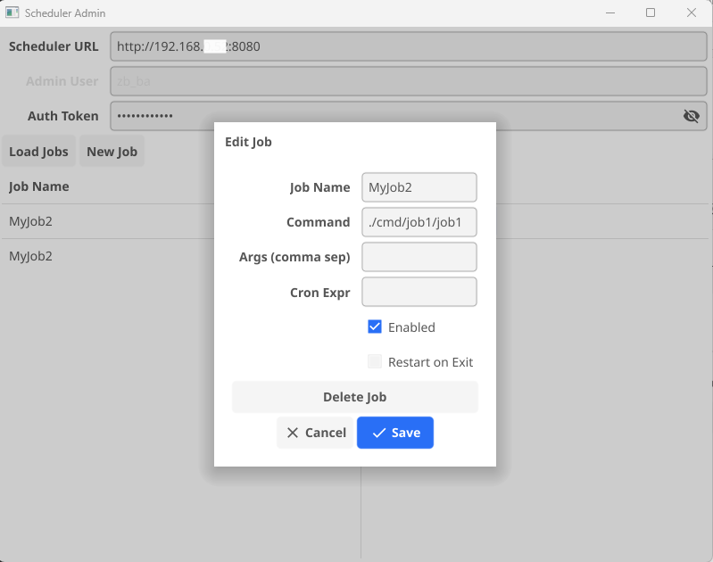

# Scheduler Admin - Desktop GUI Documentation

This document describes the **Scheduler Admin** desktop GUI client located in [cmd/scheduler-admin](file:///home/zb_bamboo/DEV/__NEW__/Go/go_scheduler/cmd/scheduler-admin).

The Scheduler Admin tool is a cross-platform desktop application designed to interact with the Go Scheduler daemon remotely via the HTTP REST API. It is built using the **Fyne** UI framework.

---

## 1. Technical Stack & Dependencies

- **GUI Framework**: `fyne.io/fyne/v2`
- **Operating Systems**:
  - **Linux**: Uses X11 or Wayland, rendering with OpenGL.
  - **Windows**: Native desktop container with specialized COM/WinRT bindings.
- **Windows Biometrics**: Uses the Windows Runtime (WinRT) `Windows.Security.Credentials.UI.UserConsentVerifier` API for fingerprint or face recognition.
  - On Windows: Utilizes OLE thread pools and WinRT COM APIs (implemented in [hello_windows.go](file:///home/zb_bamboo/DEV/__NEW__/Go/go_scheduler/cmd/scheduler-admin/hello_windows.go) and [windows/security/credentials/ui](file:///home/zb_bamboo/DEV/__NEW__/Go/go_scheduler/windows/security/credentials/ui)).
  - On Linux/macOS: Standard fallback returns success instantly (implemented in [hello_other.go](file:///home/zb_bamboo/DEV/__NEW__/Go/go_scheduler/cmd/scheduler-admin/hello_other.go)).

---

## 2. Compilation and Build

To build the executable, run the appropriate command from the project root:

### For Linux

Ensure development libraries for X11, OpenGL, and gcc are installed (e.g. `libgl1-mesa-dev`, `xorg-dev` on Debian/Ubuntu):

```bash
go build -o ./bin/scheduler-admin ./cmd/scheduler-admin
```

### For Windows

If compiling from a Windows development environment:

```powershell
go build -ldflags="-H=windowsgui" -o .\bin\scheduler-admin.exe .\cmd\scheduler-admin\main.go .\cmd\scheduler-admin\hello_windows.go
```

The `-H=windowsgui` flag prevents a command prompt window from popping up behind the GUI.

---

## 3. UI Layout & Controls

The interface is structured into three main visual blocks:

### 3.1 Connection Settings Form

Located at the top of the window:

- **Scheduler URL**: The URL where the Go Scheduler REST API is hosted (defaults to `http://localhost:8080`).
- **Admin User**: Automatically populated with the current OS username (e.g. `admin1` or your Windows username). This field is disabled to enforce identity binding with the operating system session.
- **Auth Token**: A password/masked entry field. Enter the matching token defined for your user inside the encrypted `config.json` file.

### 3.2 Action Toolbar

Directly below the form:

- **Load Jobs**: Fetches the list of job configurations from the remote scheduler and updates the job grid.
- **New Job**: Opens a blank Job Editor dialog to create a new cron configuration.

### 3.3 Jobs Table

A table displaying the retrieved job list:

- **Job Name Column**: Name of the job configuration.
- **Status Column**: Indicates if the job is `Enabled` or `Disabled`.
- Clicking on any row in the table opens the **Job Editor** for that job.

---

## 4. Administrative Features

### 4.1 Job Editor Dialog

When creating or editing a job, a modal dialog presents the following input fields:

- **Job Name**: Unique identifier name (used to update existing configurations).
- **Command**: Absolute or relative path to the executable command.
- **Args (comma sep)**: Comma-separated list of command-line arguments (e.g. `-v,--port,80`).
- **Cron Expr**: Standard 5-field cron statement governing execution schedule (e.g. `*/5 * * * *`).
- **Enabled**: Checkbox to toggle the schedule active status.
- **Restart on Exit**: Checkbox. If checked, the daemon automatically spawns the process again if it terminates with a failure exit code.
- **Delete Job Button**: Displays only when editing an existing job. Prompts for deletion confirmation.
- **Save/Cancel**: Commits updates to the database or discards changes.

---

## 5. Security & Biometrics (Windows Hello)

On Windows, the application requires biometric confirmation prior to initiating REST API calls (loading, saving, or deleting jobs).



- **Fingerprint/Face Verification**: The operating system displays a native Windows Hello consent window.
- **Fail-Safe**: If Windows Hello is not set up or not available on the device, the API actions are blocked, protecting the server configuration from unauthorized desktop access.

---

## 6. Screenshots





